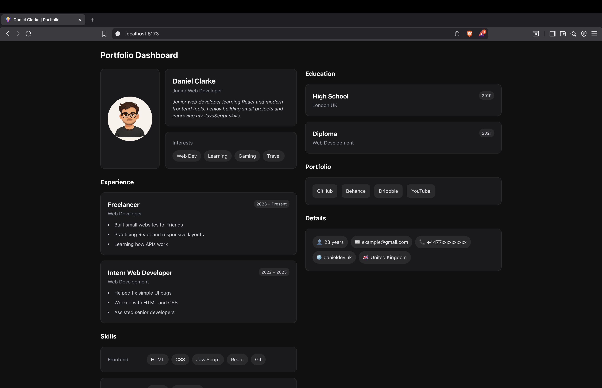

# Daniel Clarke Portfolio

Simple personal portfolio dashboard built while learning React and TailwindCSS.

## Tech Stack

- **React** – UI library
- **TailwindCSS** – Utility-first CSS
- **JavaScript/TypeScript** – Language

## Features

- Profile section with avatar and bio
- Experience timeline
- Skills section
- Education section
- Portfolio links
- Contact details

## Installation

```bash
npm install
npm run dev
```

## Project Structure

```
src/
├── components/       # Reusable UI components
│   ├── AvatarCard.tsx
│   ├── InfoCard.tsx
│   ├── SkillBadge.tsx
│   ├── PortfolioLinkButton.tsx
│   └── sections/     # Section components
│       ├── ProfileSection.tsx
│       ├── ExperienceSection.tsx
│       ├── SkillsSection.tsx
│       ├── EducationSection.tsx
│       ├── PortfolioSection.tsx
│       └── DetailsSection.tsx
├── pages/            # Page components
│   └── Portfolio.tsx
└── assets/           # Images and static files
```

### Components

- **AvatarCard** – Displays profile avatar
- **InfoCard** – Reusable card for experience/education entries
- **SkillBadge** – Badge for skills and interests
- **PortfolioLinkButton** – Link button for portfolio sites

### Sections

- **ProfileSection** – Avatar, name, bio, interests
- **ExperienceSection** – Work experience timeline
- **SkillsSection** – Frontend and design skills
- **EducationSection** – Education history
- **PortfolioSection** – Links to GitHub, Behance, etc.
- **DetailsSection** – Contact details (email, phone, location)

## Screenshot



## Status

This project is a learning project and will continue to be improved.

## Author

**Daniel Clarke**  
Junior Web Developer

## Contact

- **Email:** [example@gmail.com](mailto:example@gmail.com)
- **Phone:** +4477xxxxxxxxxx
